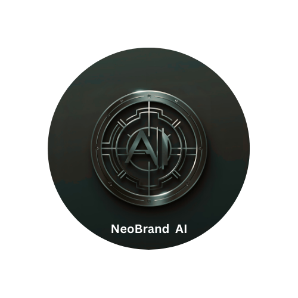
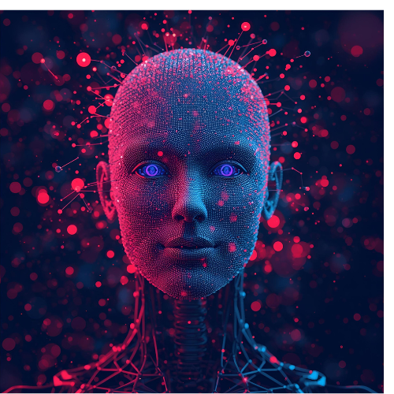

# PHASE 1  

  

## Business Name  
**NeoBrand AI**

## Tagline  
*"Future-Proof Your Brand with AI."*

---

## Brand Mission  
At **NeoBrand AI**, our mission is to empower startups and small businesses with cutting-edge, AI-driven branding solutions.  
We combine human creativity with artificial intelligence to craft impactful logos, stories, and digital assets that help brands stand out in the modern marketplace.  

---

## Brand Story  
In today’s fast-moving digital world, businesses struggle to stay relevant and differentiate themselves.  
Traditional branding agencies often take weeks or months to deliver results, leaving startups behind in a competitive market.  

That’s where **NeoBrand AI** comes in.  

Our agency was born out of the belief that branding should be fast, intelligent, and accessible.  
By harnessing the power of AI tools like **ChatGPT** for storytelling and **Canva Magic Media** for sleek visuals, we help businesses launch with professional-grade branding in days, not months.  

Whether it’s crafting a unique logo, building a social media identity, or designing a website mockup, we use AI to blend creativity with efficiency.  
For us, it’s not just about design — it’s about **future-proofing brands** so they can thrive in an AI-powered economy.  

---

# PHASE 2: Proof of Value  

## AI-Generated Social Media Post Example  

  

This example, generated with **Canva Magic Media**, demonstrates how AI can instantly create **vibrant and engaging branding assets** for businesses.  
It showcases the power of AI in helping startups **launch, adapt, and market their brand identity quickly** in today’s fast-moving digital landscape.  

---

# PHASE 3: Future Vision  

At **NeoBrand AI**, we believe the future of branding lies in the **seamless collaboration between human creativity and AI intelligence**.  
Our vision includes:  

- Expanding to **AI-driven website design** that adapts to user behavior.  
- Offering **personalized brand assistants** powered by AI chatbots.  
- Creating **dynamic brand kits** that evolve with market trends.  

By doing so, we will not only help startups get started but also **keep them relevant** as the digital world keeps changing.  

---

# Final Notes  

NeoBrand AI answers the critical questions startups face:  

✅ **Who are we?**  
We are an **AI-powered branding agency** focused on speed, creativity, and accessibility.  

✅ **Why do we exist?**  
To make branding **faster, smarter, and more affordable**, so small businesses can compete with big players.  

✅ **How do we deliver value?**  
By combining **AI tools** (like ChatGPT, Canva Magic Media) with **human insight** to deliver logos, stories, and digital assets in **days, not months**.  

✅ **What’s our future?**  
A world where **AI and creativity fuse together**, giving every business a chance to thrive in the digital economy.  

---

  <em>NeoBrand AI — Future-Proof Your Brand with AI.</em>

